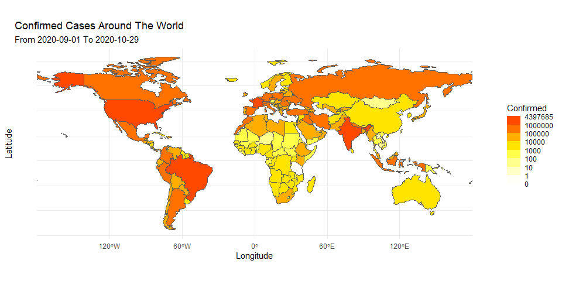
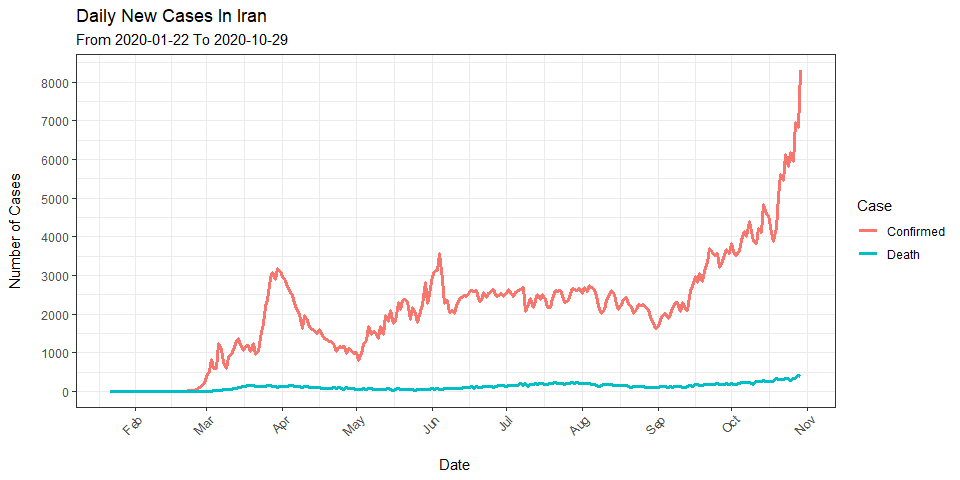

<!-- README.md is generated from README.Rmd. Please edit that file -->

# covid19Tracker

<!-- badges: start -->

<!-- badges: end -->

The goal of covid19Tracker is to facilitate exploration of Coronavirus
disease (COVID-19) dataset. The dataset is provided by [JHU CSSE
COVID-19 Data](https://github.com/CSSEGISandData/COVID-19) and is
updated everyday.

The dataset includes new cases, cumulative cases, new deaths and
cumulative deaths for each day. It also contains geographical
coordinates(Lat,Long) for each country.

This package provide functions to:

  - View full dataset in a tidy format
  - Plot total cases in a selected period of time on the world map
  - Plot daily cases of a specific country in a selected period of time

## Installation

<!-- You can install the released version of covid19Tracker from [CRAN](https://CRAN.R-project.org) with: -->

<!-- ``` r -->

<!-- install.packages("covid19Tracker") -->

<!-- ``` -->

You can install the development version from
[GitHub](https://github.com/) with:

``` r
# install.packages("devtools")
devtools::install_github("PlasterPate/covid19Tracker")
```

## Examples

### Getting data

``` r
library(covid19Tracker)
dataset <- fetchData()
head(dataset)
#> # A tibble: 6 x 8
#> # Groups:   Region [1]
#>   Region      Date       CumConfirmed Confirmed CumDeath Death   Lat  Long
#>   <chr>       <date>            <dbl>     <dbl>    <dbl> <dbl> <dbl> <dbl>
#> 1 Afghanistan 2020-01-22            0         0        0     0  33.9  67.7
#> 2 Afghanistan 2020-01-23            0         0        0     0  33.9  67.7
#> 3 Afghanistan 2020-01-24            0         0        0     0  33.9  67.7
#> 4 Afghanistan 2020-01-25            0         0        0     0  33.9  67.7
#> 5 Afghanistan 2020-01-26            0         0        0     0  33.9  67.7
#> 6 Afghanistan 2020-01-27            0         0        0     0  33.9  67.7
```

### Visualizing data

``` r
plotWorldMap(dateRange = c("2020-09-01", "2020-10-30"), type = "Confirmed")
```



``` r
plotCountryTimeline(dateRange = c("2020-01-01", "2020-12-29"), country = "Iran")
```


